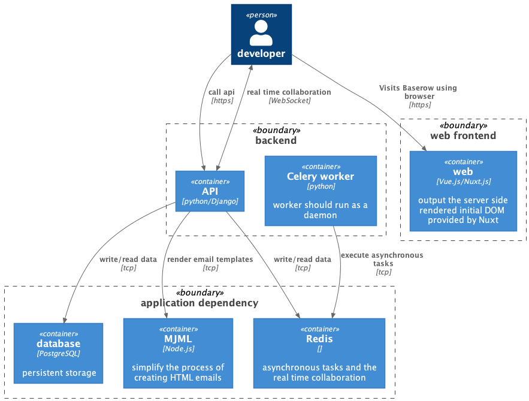

# Development environment

If you want to contribute to Baserow you need to setup the development environment on
your local computer. The best way to do this is via `docker-compose` so that you can
start the app with the least amount of hassle.

## Installing requirements

If you haven't already installed docker and docker-compose on your computer you can do
so by following the instructions on https://docs.docker.com/desktop/.

If you haven't already installed git you can do so by following the instructions on
https://www.linode.com/docs/development/version-control/how-to-install-git-on-linux-mac-and-windows/
.

Once you have finished installing all the required software you should be able to run
the following commands in your terminal.

```
$ docker -v
Docker version 19.03.8, build afacb8b
$ docker-compose -v
docker-compose version 1.25.5, build 8a1c60f6
$ git --version
git version 2.24.3 (Apple Git-128)
```

If all commands return something similar as described in the example, then you are ready
to proceed!

## Starting development environment

> If you run into any issues starting your development environment feel free to contact 
> us via the form on https://baserow.io/contact.

For example purposes I have created a directory in my home folder named `baserow`. You
can of course follow the steps in any directory, but in this tutorial I will assume the
working directory is `~/baserow`.

First we have to clone the repository. Execute the following commands to clone the
master branch. If you are not familiar with git clone, this will download a copy of
Baserow's code to your computer.

> Note that if you have already started the
> [demo environment](../guides/demo-environment.md) once, you might need to rebuild
> the images for the development environment by using the command
> `docker-compose up -d --build` because they have container name conflicts.

```
$ cd ~/baserow
$ git clone git@gitlab.com:bramw/baserow.git
Cloning into 'baserow'...
...
$ cd baserow
```

Now that we have our copy of the repo and have changed directories to the newly
created `baserow`, we can bring up the containers. You just have to execute the
docker-compose command using the `docker-compose.demo.yml` file. It might take a while
for the command to finish, this is because the image has to be built from scratch.

```
$ docker network create baserow_default
$ docker-compose up -d
Building backend
...
Starting db    ... done
Starting mjml    ... done
Starting redis    ... done
Starting backend    ... done
Starting web-frontend   ... done
```

## Starting backend development server

Now that you have your development environment up and running, you need to apply all the
database migrations and start the backend's development server. You need to execute the
bash command of the backend container first. Because Baserow is not installed as a
dependency you have to use the manage.py file in the source directory.

```
$ docker exec -it backend bash
$ python src/baserow/manage.py migrate
Running migrations:
...
$ python src/baserow/manage.py runserver 0.0.0.0:8000
```

After executing these commands, the server is running. If you visit
http://localhost:8000/api/groups/ in your browser you should see the response
"Authentication credentials were not provided." If you want to see the API spec, you can
visit http://localhost:8000/api/redoc/.

## Starting the worker

In order to process asynchronous tasks you also need to start a Celery worker this is
mainly used for the real time collaboration. Open a new tab or window and execute the
following commands. The `watchmedo` command makes sure the worker is restarted whenever
you make a change.

```
$ docker exec -it backend bash
$ watchmedo auto-restart --directory=./ --pattern=*.py --recursive -- celery -A baserow worker -l INFO
```

## Starting web frontend development server

Now that the backend server is up and running you can start the web-frontend development
server. Open a new tab in your terminal and execute the bash command of the web-frontend
container first. After that you need to install all the dependencies that the
web-frontend app relies on.

```
$ docker exec -it web-frontend bash
$ yarn install
$ yarn run dev
```

Once those commands have executed and the development server is running you can visit
http://localhost:3000 in your browser which should show the Baserow login page.

## Keep the servers running.

Both the web-frontend and backend containers need to keep running while you are
developing. They also monitor file changes and update automatically so you don't need to
worry about reloading. Go and make some changes yourself. You should see the result
right away.

## Server architecture

