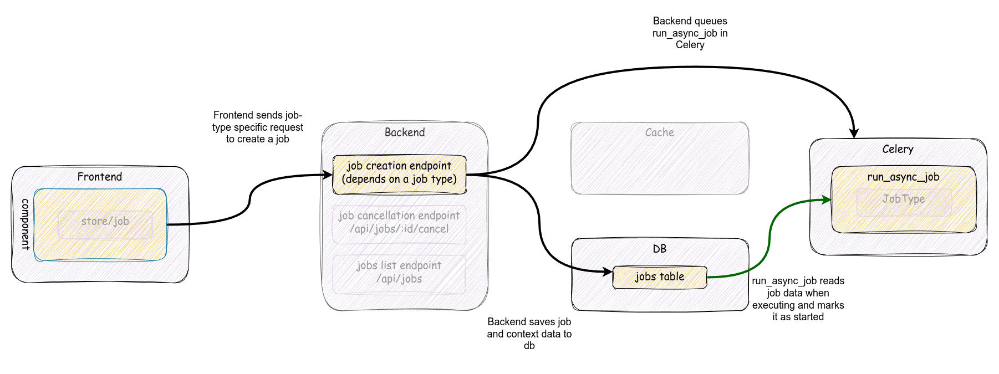
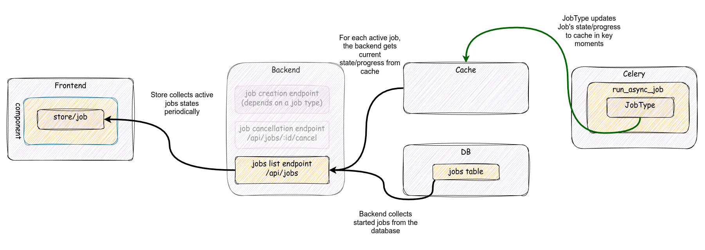
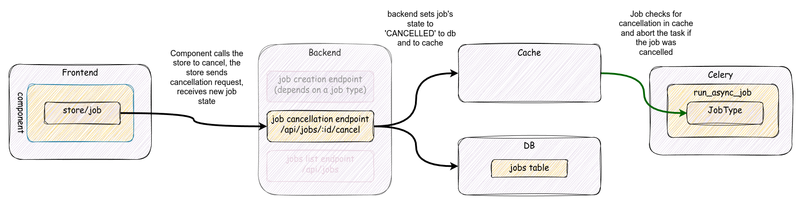

# Job handling overview

This document is intended for developers who want to work with job subsystem. It's an overview documentation to describe main concepts, components and workflows, and shows possible extension points.

Job subsystem allows to move costly operations, like exporting data, updating calculated
values in tables or updating indexing information etc, outside backend process. Jobs are
created in the backend, but they are scheduled on a task queue and executed in Celery
worker.

Job subsystem is an internal framework in Baserow. It follows several common patterns
used in the backend application. The main components are:

* `baserow.core.jobs.handlers:JobHandler` - a handler class that wraps common routines
  for job management
* `baserow.core.jobs.job_types:JobType` - registry-based hierarchy of specific job
  types. Using a `JobType`-based subclass registry allows to extend available
  functionalities/tasks executed as a job using the same management interface.
* `baserow.core.jobs.models:Job` base model class - each schedule job may need to know
  extra context to execute properly. `Job` subclasses can store such information for the
  execution. Base Job model stores basic job information: identification, ownership and
  a current state.

## Job workflow

A job workflow contains 3 main workflows:

* job creation and execution
* job cancellation
* job status update

Note: each part (frontend, backend, celery) runs in separate containers and uses
different communication channels to pass messages/data. The communication may be
synchronous or asynchronous depending on a specific path.

Additionally there's a job cleanup task that is independent but also supplementary.

### Job creation and execution

Celery task queue receives a task to execute a specific job (`run_async_task` with job
id). Job tasks are scheduled to `export` worker. A worker will attempt to execute the
task, however:

* there is no guarantee that a job will be picked and started in any specific time frame
* there is no guarantee that a job will be executed correctly
* if a job fails, it won't be resumed
* a job may not elapse more than a `BASEROW_MAX_TASK_TIME` limit
* all jobs are cleaned (removed) from the database after specific period.
  See [Job cleanup](#job-cleanup) for details.
* a job can be cancelled by a user during it's execution.

Job creation depends on a job type. There's no one way nor a generic endpoint to create
a job. Each job type is created with a dedicated endpoint. However, each endpoint that
is responsible for job creation should return a proper job structure enriched with
job-specific properties.

Basic workflow of job creation and execution is shown on a graph below:



The workflow consists of following steps:

* frontend component calls job-type specific endpoint to create a job
* job-type specific endpoint internally should internally call
  `baserow.core.jobs.handlers:JobHandler.create_and_start_job()` method to create job
  instance and schedule it's execution. This call doesn't have to be in a view. It can
  happen in lower code layers in a dedicated handler which should prepare all job-type
  specifics. This is the final step for the backend.
* Celery worker picks up `baserow.core.jobs.tasks:run_async_job` task, gets a job from
  the database, sets its state to `started` and calls `JobHandler.run()` in a
  transaction. See below for details on transaction handling.
* If a job has been completed it will be marked as `finished`. Otherwise it should be
  marked as `failed` or `cancelled`. [See "Job cancellation"](#job-cancellation) for
  details on the latter state.

A job is executed in a transaction with repeatable reads isolation level, which
guarantees data snapshot consistency in the database. This is an important factor for
tasks that operates on whole databases, preserving between-tables linkage consistency.

This also blocks other processes to access current job state. To overcome
this [cache layer is used to proxy state reads](#cache-layer).

If a job fails or is cancelled, it will raise appropriate exception and the transaction
ill be aborted. This allows to cleanup any database resources created by a job
automatically.

### job state update





When a job is being executed it should update periodically (in key moments) its
current [state](#job-state) and [progress value](#progress-tracking) .

Job status update is a workflow where a job propagates it's current status. The progress
is usually monitored by frontend's component for the user. Because the task is executed
in a transaction, other processes cannot see current state from the database and we
use [cache as a proxy for state values](#cache-layer).

The workflow of querying for job state update:

* a job updates `Progress` instance in key moments of its processing.
* In the frontend job store periodically queries the backend for a list of active
  jobs [(see Job store for details)](#job-store)
* the backend (after checking for permissions and applying internal filtering):
    * queries the database for specified jobs
    * when serializing the response it gets `Job.state` and `Job.progress_percentage`
      values from the cache and then from the db if cache doesn't provide any

### Job cancellation




Job subsystem allows to cancel a job before or during its execution. The cancellation
should be triggered by a user that is an owner of a job. A cancellation request means
the user is not interested in any continuation of job's execution and any result or a
product of such execution should be discarded.

Due to asynchronous nature of the communication between components and job execution,
the cancellation is not immediate and the request may be received after a job has been
finished. Because a job has been finished already, it cannot be cancelled. In that case,
a `JobNotCancellable` error will be raised.

Job cancellation workflow:

* a user that is the owner of the job should have a UI to trigger the cancellation
* a component should call `cancelJob()` method which will call `/api/job/$id/cancel/`
  endpoint in the backend.
* the backend will check ownership of the job
* the backend will check job's state to ensure it can be cancelled
* the backend will set `Job.state` to `cancelled` in the model
  and [in the cache](#cache-layer). This is the final step for the backend.
* if a job has not been started yet, `run_asyc_job` won't start this job.
* if a job is being processed, job's handling will check if job's state wasn't set to
  `cancelled` state in the cache. If the state has been set, the task should stop
  execution of the task immediately. If not, the state will be updated with current
  job's state in the worker.

Sending cancellation to a running job is not straightforward, because the job is
executed synchronously in the worker, so there's no good side channel to inject an
information that this job has been cancelled from the outside.

A check if a job has been cancelled is performed in certain key moments of the
execution:

* when a job updates its progress. See [Progress notes](#progress-tracking) for details.
* in `JobHandler.run()` when an actual job has been cancelled, but the execution control
  wasn't returned to the `run_async_job` task.

### Job cleanup

Job cleanup is an independent task that is executed with Celery periodically. The base
intention is that all jobs that have been created longer than
`BASEROW_JOB_EXPIRATION_TIME_LIMIT` (by default: 30 days) and are not running (so they
are finished, cancelled or failed) should be removed from a permanent store and all jobs
that were created more than `BASEROW_JOB_SOFT_TIME_LIMIT` (30 minutes) ago should be
marked as failed due to a timeout.

Note, that when a job is being removed, `JobType.before_delete()` hook will be called.
This is a hook that allows to do any job-type cleanup.

## Backend

### JobType

A `JobType` class is a base class for any specific job type. Its main purpose is to
provide a common interface to run specific job's actions. When implementing a new job
type only `JobType.run` method is required to be implemented. However, there are other ways such subclass can customize Job-related aspects:

* hook into job creation by preprocessing values provided by a user/postprocessing a created job
* hook for job deletion
* job error handler
* custom job serializer fields or a custom serializer for a job model
* map exceptions to specific HTTP response codes
* have [a model class](#job-sub-models)

### Job sub-models

Each `JobType` subclass should have accompanying `Job` model subclass. A subclass should store input values and results (fields with specific values or file fields for file-based results) if required. 

#### Job state

`Job.state` stores job state description. The value here can be one of predefined
constant values for known states:

* `pending` - when a job is scheduled and waits to be picked up by a Celery worker
* `started` - when a job has been started
* `finished` - when a job has been finished successfully
* `cancelled` - when a job has been cancelled
* `failed` - when an error happened during the execution. Details of the error should be
  present in `error` and `human_readable_error` properties.

However, other values can be present. In that case, it should be more descriptive. An
example is a create snapshot job type which sets state to `import-table-$id` for each
table that is being created in a snapshot dataset.

Because of such variety of possible values, job's state must be interpreted properly to
tell if a job is running or not. Such interpretation happens in the backend (
`Job.object` has dedicated methods to get pending/running/finished querysets) and in the
frontend (`mixin/job` provides calculated properties for different states).

### JobHandler

### Progress tracking

Each job receives an instance of `baserow.core.utils:Progress` class which is a helper
to track progress of any job. `Progress` class can use child instances to track
fragmentary progress if a job can have sub-tasks that should be tracked independently
but within specific boundaries of a parent progress. For example: a job updates its
`Progress` instance to 40% and then runs a code that internally tracks its progress from
0% to 100%, but from job's perspective it's an increase from 40% to 50%. A child
progress will notify parent of it's change and the parent will recalculate its relative
change.

`Progress` class can also receive a callback function to be called when its progress
value changes.

When a `JobHandler.run` creates a `Progress` instance, it adds to progress tracker a
callback. This callback will:

* receive current job instance
* check with cache if the job is cancelled and raise `JobCancelled` exception.
* update `Job.state` and `Job.progress_percentage` values locally and
  refresh [cached values](#cache-layer).

## Cache layer

During job's execution cache layer is used to speed up propagating the state of a job
between the backend and Celery worker. Because a job is executed in a transaction, local
changes to the job will be invisible to other database sessions. Cache is used (Redis
store) as a proxy to current `Job.state` and `Job.progress_percentage` values in the
backend process. Also, this is a channel to propagate cancellation state back to the
worker.

Job's cache key is constructed from `Job.id`. It's a dictionary with `state` and
`progress_percentage` keys.

Once a job execution is completed, cache entry for that job should be removed.

## Frontend

Vue application tries to utilize common Vue patterns to manage job state. Any component
that creates or want to check job's execution state should use those.

Each job type can have different initial parameters and usually a job is initialized by
a different endpoint. This makes job creation a variable.

### Job store

Job store is used to manage state of active jobs that were created by the current user.
Usually a single user has no more than a few running jobs. Job store internally tracks
state of those jobs by querying `/api/jobs/` endpoint with specific job identifiers.

Job store exposes `job/create` action which adds a job structure to the store and
initializes internal poller.

The poller will work until all jobs in store are not in finished states (
finished/cancelled/failed). When a new job is added the poller is reinitialized again.

### Job mixin

The main connector between a component and the store is `mixin/job` mixin. This mixin
provides helpers to properly expose job's state and act on state's change. A component
can define callbacks to extend behavior on job state's change.

### Usage in components

* Vue component that wants to interact with a job of any type should use provided
`mixin/job` mixin. As written above, this mixin provides a skeleton to handle job state
management in the frontend.
* the mixin provides:
  * properties:
    + `job`
    + `jobIsRunning`
    + `jobIsFinished`
    + `jobHasSucceeded`
    + `jobHasFailed`
  * methods:
    + `createAndMonitorJob(job)` - a method to add a `job` object to the store.
    + `cancelJob()` - a method to cancel a job. It expects `job` property to be set.
* the mixin expects the component will provide callbacks:
  * `onJobDone()`
  * `onJobFailed()`
  * `onJobCancelled()`
  * `showError({error,message})`
* the component should create a job on its own and call `createAndMonitorJob` with a `job` instance.
* the component should use `ProgressBar` sub-component to display the progress:

```vue
<ProgressBar
            :value="job.progress_percentage"
            :status="jobHumanReadableState"
          />
```
* buttons for job creation/cancellation are up to the component. Their state can utilize properties above to control visibility.

